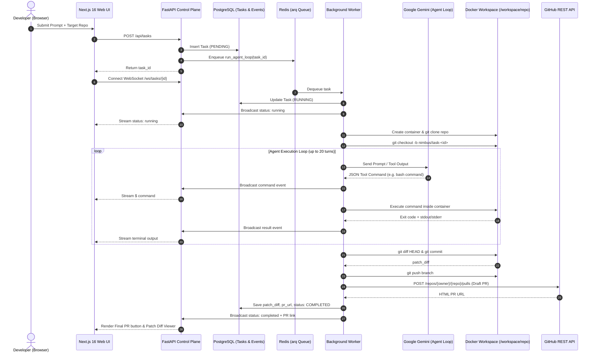
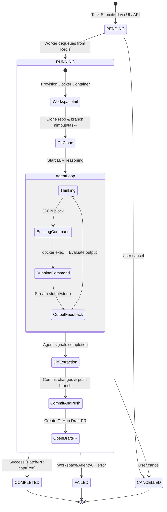

# Nimbus Architecture

## Overview

Nimbus is an autonomous, cloud-native software engineering agent system. Users delegate coding tasks through a modern web UI, while a trusted control plane orchestrates an isolated, ephemeral cloud sandbox to inspect repositories, make code edits, execute test suites, capture patches, and open GitHub Pull Requests.

---

## Architectural Diagrams

### 1. End-to-End Execution Sequence



---

### 2. Trust Boundaries & Security Isolation

```mermaid
graph TD
    subgraph Trusted Zone ["🔒 Trusted Control Plane (Host / Cloud)"]
        UI["Web Frontend (Next.js 16)"]
        API["FastAPI Control Plane"]
        DB[("PostgreSQL 16\nTasks & Append-Only Events")]
        Redis[("Redis / arq Queue")]
        Worker["arq Background Worker"]
        Secrets["Secret Store\n(GEMINI_API_KEY, GITHUB_TOKEN)"]
        LLM["Google Gemini 2.5"]
    end

    subgraph Untrusted Zone ["⚠️ Untrusted Disposable Sandbox (Docker)"]
        Container["Ephemeral Docker Container\n(nimbus-task-<id>)"]
        Repo["/workspace/repo\nCloned Repository Code"]
        Tools["Pre-installed Build Tools\n(git, python3, build-essential)"]
    end

    UI <-->|HTTPS / WSS| API
    API <--> DB
    API <--> Redis
    Redis <--> Worker
    Worker <--> DB
    Worker --- Secrets
    Worker <-->|REST API| LLM
    Worker -->|docker exec (isolated pipes)| Container
    Container --- Repo
    Container --- Tools
    Worker -->|GitHub App / PAT| GitHub["GitHub API (Draft PR)"]
```

---

### 3. Task & Event State Machine



---

## Core Components

### 1. Web Application (`frontend/`)
- Built with **Next.js 16 (App Router)** and React 19.
- Glassmorphic dark UI offering prompt submission, repository selection, live streaming terminal with auto-scroll, real-time status badges, and expandable patch diff views.
- Replays historical events immediately upon connecting to WebSocket endpoint `/ws/tasks/{id}`.

### 2. Control Plane API (`backend/app/main.py`)
- Built with **FastAPI** and **SQLAlchemy (Asyncpg)**.
- REST endpoints:
  - `POST /api/tasks`: Create task and enqueue execution job.
  - `GET /api/tasks/{task_id}`: Retrieve task status, prompt, repository details, patch diff, and PR link.
  - `POST /api/internal/tasks/{task_id}/events`: Event receiver for worker broadcast.
  - `WebSocket /ws/tasks/{task_id}`: Streaming gateway broadcasting events to browser clients.

### 3. Background Worker & Agent Loop (`backend/app/worker.py`)
- Powered by `arq` and Redis for asynchronous job processing.
- Coordinates the Google Gemini agent loop using structured command generation, execution feedback, and error self-correction.
- Automatically captures git diffs, commits changes, and interacts with GitHub to open Draft PRs.

### 4. Workspace Provider (`backend/app/workspace.py`)
- Ephemeral Docker sandbox managing the complete lifecycle of isolated execution environments.
- Automatically handles repository cloning, branch provisioning, git configuration, tool installation, and cleanup.

### 5. GitHub Integration (`backend/app/github_client.py`)
- Lightweight REST client managing GitHub API interactions:
  - Repository URL extraction.
  - Draft Pull Request creation on feature branches.
  - Fallback base branch detection (`main` / `master`).

---

## Durable Event Contract

All state mutations in Nimbus are captured as append-only `TaskEvent` records:

| Event Type | Description | Payload Structure |
| :--- | :--- | :--- |
| `status` | State transitions (`pending`, `running`, `completed`, `failed`, `cancelled`) | `{"status": "running"}` |
| `log` | Informational messages & system milestones | `{"message": "Docker workspace ready..."}` |
| `command` | Bash commands executed by the autonomous agent | `{"command": "pytest tests/"}` |
| `result` | Output, exit codes, and stdout/stderr from sandbox execution | `{"output": "[Exit code: 0]\n..."}` |

---

## V1 Non-Goals

1. Hosting persistent VS Code server instances in workspaces (disposable sandboxes only).
2. Unrestricted internet egress from sandbox containers.
3. Multi-agent swarms without deterministic orchestrator supervision.
